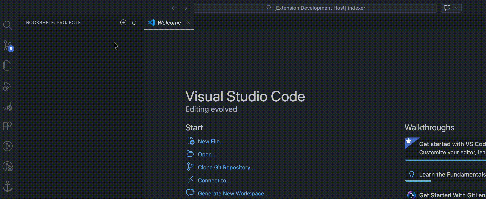
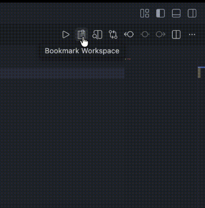
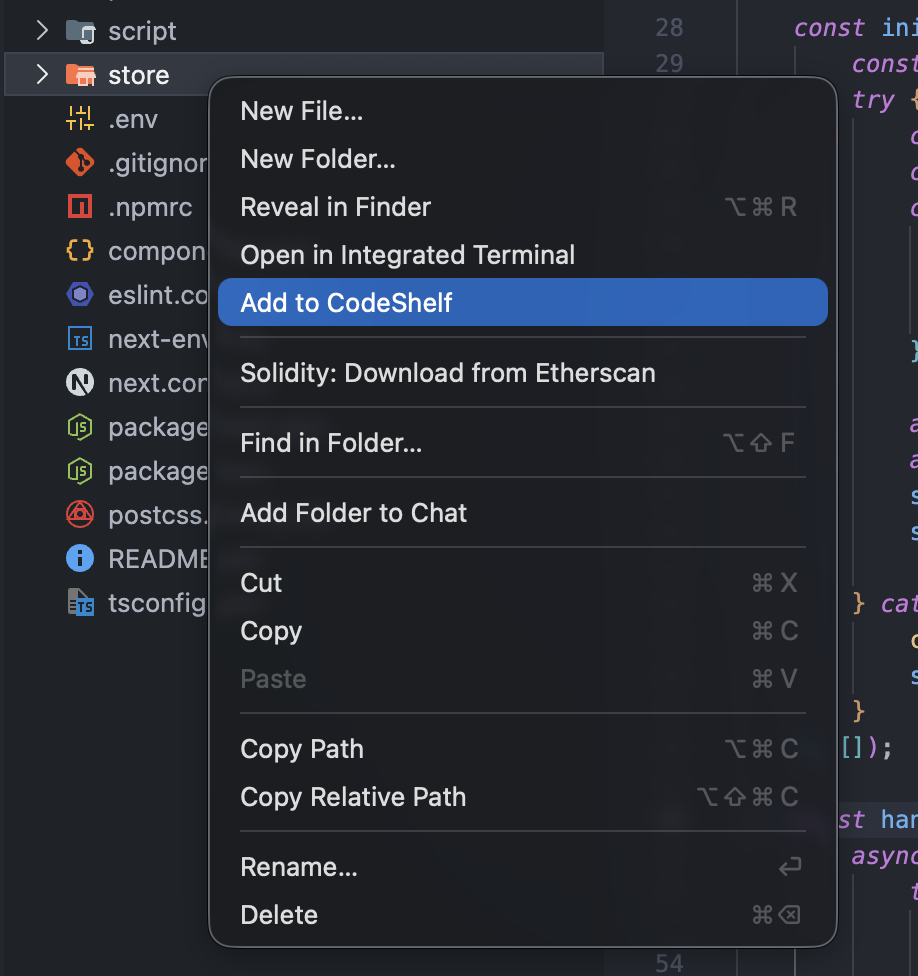
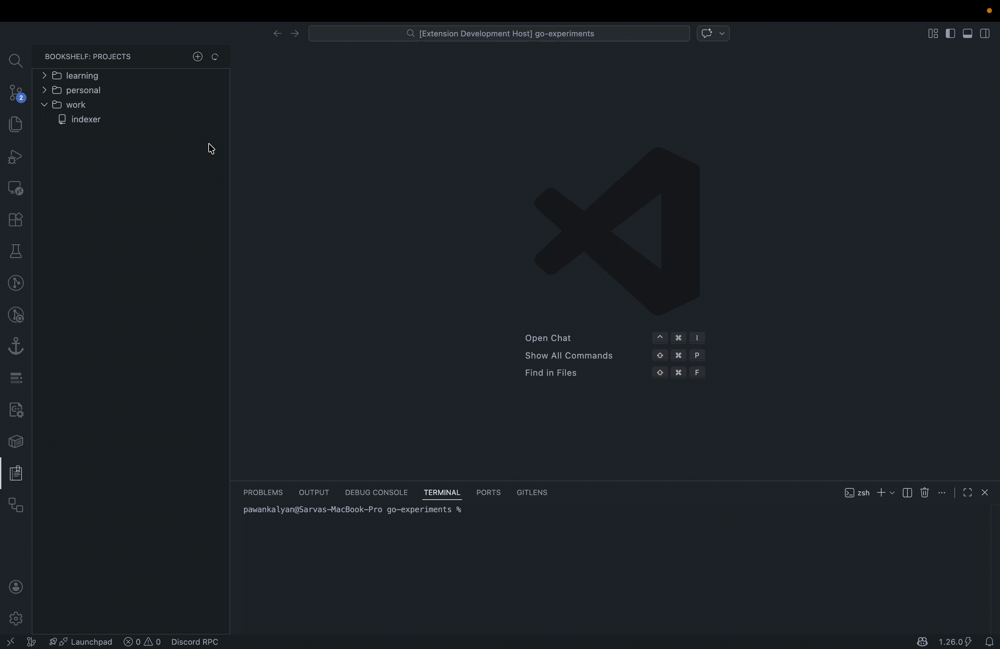
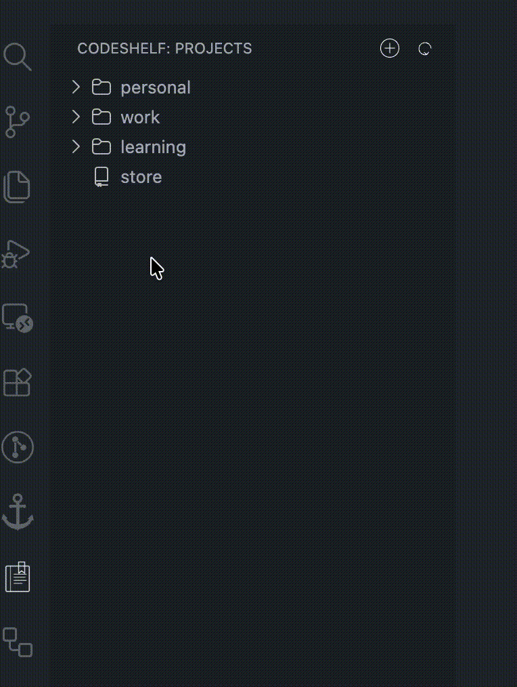
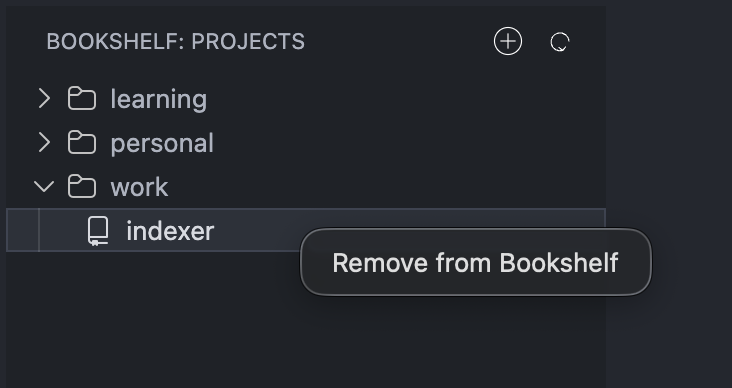
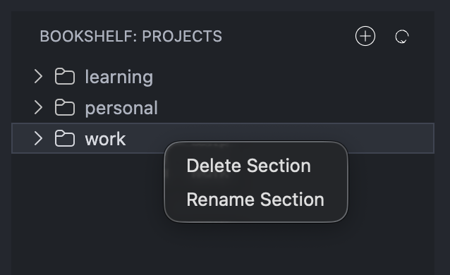

# CodeShelf - Bookmark & Project Manager for VS Code
Lightweight project manager and bookmark extension for organizing and launching multiple projects inside VS Code.

**Organize your projects. Own your workspace.**

CodeShelf is a lightweight VS Code extension that helps you organize, group, and manage your local projects with sections and drag-and-drop support, all inside the Activity Bar.

---

## Features

### Sections
- Create custom sections (Work, Personal, Clients, etc.)
- Rename sections
- Delete sections (removes all projects inside)

### Project Bookmarks
- Add current workspace to CodeShelf
- Add folders directly from Explorer (right-click → **Add to CodeShelf**)
- Prevent duplicate projects (based on path)

### Drag & Drop
- Drag projects into sections
- Move projects between sections
- Organize visually with ease

### Remove Projects
- Right-click project → **Remove from CodeShelf**

### Auto Cleanup
- Automatically removes projects whose folders no longer exist on load
- Manual **Refresh** button to revalidate all project paths

### Quick Access
- Click a project to open it in a new VS Code window

---

## How to Use

### Add a Section
1. Open **CodeShelf** from the Activity Bar
2. Click the ➕ icon
3. Enter section name



### Bookmark Current Workspace
Click the bookmark icon in the top right editor title bar.



### Add Project from Explorer
1. Right-click any folder in VS Code Explorer
2. Click **Add to CodeShelf**
3. It will be added to the root of CodeShelf



## Open project from CodeShelf
Click on any project to open the project in new window



## Manage your projects by Drag-N-Drop
- Organize projects effortlessly by dragging them into custom sections.
- Reorder and regroup projects instantly with smooth, intuitive drag-and-drop support.




## Remove a Project
Right-click on the project → **Remove from CodeShelf**


## Rename or Delete a Section
Right-click on the section → choose action


## Refresh CodeShelf
Click the refresh icon to:
- Remove deleted/missing project folders
- Revalidate project paths

---

## How It Works

CodeShelf stores project paths locally using VS Code’s `globalState`.

Each project is uniquely identified by its file system path to prevent duplicates.

---

## Why Use CodeShelf as Your Project Manager ??

If you:
- Work across many repositories
- Switch contexts often
- Want visual grouping of projects
- Need fast project launching

CodeShelf keeps your development life structured.

---

## Data & Privacy

CodeShelf:
- Does not collect data
- Does not send data externally
- Stores everything locally on your machine

---

## Upcoming Features

Planned improvements:
- Drag to reorder sections
- Project search
- Import / export configuration
- Sync across devices
- Color tags
- Section collapse state persistence

---

## Development

To run locally:

```bash
npm install
npm run watch